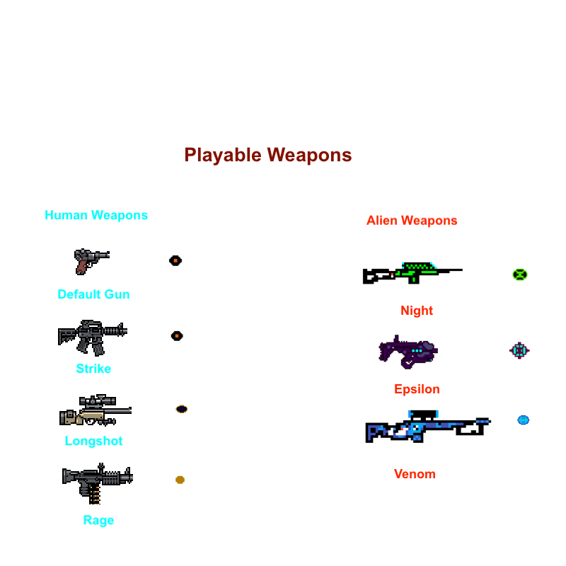

# Escape From Space

A 2D Shooter Game built using Godot Game Engine. It features
a human who has make his way through an alien spaceship
while eliminating the aliens to finally escape the spaceship

# Game Features

- This is the player:

- These are the playable weapons:

- These are the aliens:

- Following are some gameplay GIFs:

# Repository Information

## Installation Instructions

Installation instructions are present in the `INSTALL.md` file

## Directory Structure

- AI: Contains code and scene files for six AI enemies (aliens)
- Items: Contains code and scene files for seven different kinds
    of guns and bullets
- Player: Contains code and scene files for the player (human character)
- UI: Contains code and scene files for the title, controls, win and lose
    screens
- World: Contains code and scene files for the game world
- Other: Contains less relevant files
